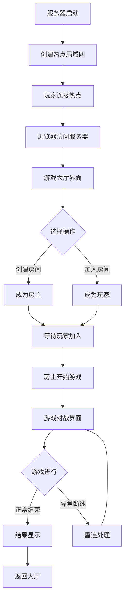

## 1. Product Overview
基于Android手机的离线本地服务器"挖坑"四人纸牌游戏系统。服务器端在Android设备上运行本地Web服务器，四位玩家通过移动设备浏览器访问游戏，无需安装额外应用。

解决传统纸牌游戏需要实体卡牌和面对面聚集的问题，让玩家在任何地点都能通过局域网进行游戏对战。

## 2. Core Features

### 2.1 User Roles
| Role | Registration Method | Core Permissions |
|------|---------------------|------------------|
| 房主 | 自动成为房间创建者 | 创建/解散房间、开始游戏、暂停游戏、管理玩家 |
| 普通玩家 | 通过局域网加入房间 | 参与游戏、出牌、查看游戏状态 |

### 2.2 Feature Module
本游戏系统包含以下主要页面：
1. **服务器管理界面**：显示连接玩家列表、房间状态监控、网络诊断、游戏日志。
2. **游戏大厅界面**：房间列表、加入房间、创建房间。
3. **游戏对战界面**：手牌显示、出牌区域、玩家状态、实时聊天。

### 2.3 Page Details
| Page Name | Module Name | Feature description |
|-----------|-------------|---------------------|
| 服务器管理界面 | 玩家列表模块 | 显示当前连接的所有玩家信息，包括昵称、连接状态、IP地址 |
| 服务器管理界面 | 房间监控面板 | 实时显示所有房间的状态，包括玩家人数、游戏进度、创建时间 |
| 服务器管理界面 | 网络诊断工具 | 检测局域网连接状态、热点信号强度、数据传输延迟 |
| 服务器管理界面 | 游戏日志查看器 | 记录和显示游戏过程中的所有操作和事件 |
| 游戏大厅界面 | 房间列表模块 | 显示可加入的游戏房间，包括房间ID、当前人数、状态 |
| 游戏大厅界面 | 创建房间功能 | 输入房间名称，创建新的游戏房间，成为房主 |
| 游戏大厅界面 | 加入房间功能 | 输入房间ID或从列表选择，加入已有房间 |
| 游戏对战界面 | 手牌显示区域 | 显示玩家当前手牌，支持拖拽出牌、排序、选牌操作 |
| 游戏对战界面 | 出牌操作区域 | 显示当前出牌要求，提供出牌、不出、提示按钮 |
| 游戏对战界面 | 玩家状态显示 | 显示其他玩家的手牌数量、出牌状态、在线状态 |
| 游戏对战界面 | 游戏信息面板 | 显示当前轮次、叫分情况、底牌信息、剩余牌数 |
| 游戏对战界面 | 实时聊天功能 | 玩家间文字聊天，支持快捷短语和自定义输入 |

## 3. Core Process
房主流程：
1. 在Android手机上启动服务器应用，创建热点局域网
2. 进入服务器管理界面，查看网络状态和连接信息
3. 创建游戏房间，设置房间参数
4. 等待其他玩家通过浏览器加入房间
5. 确认所有玩家准备就绪后开始游戏
6. 游戏过程中可以暂停、恢复或结束游戏
7. 查看游戏日志和统计信息

玩家流程：
1. 连接至房主创建的WiFi热点
2. 打开浏览器访问服务器地址
3. 进入游戏大厅，选择加入已有房间或创建新房间
4. 等待房主开始游戏
5. 根据游戏规则进行叫分、埋底、出牌等操作
6. 实时查看游戏状态和其他玩家信息
7. 游戏结束后查看结果统计

## 4. User Interface Design

### 4.1 Design Style
- **主色调**：深绿色（#2E7D32）搭配米白色（#F5F5F5），营造纸牌游戏的传统氛围
- **按钮样式**：圆角矩形，3D立体效果，悬停时有阴影变化
- **字体**：主标题使用微软雅黑24px，正文使用16px，按钮文字18px
- **布局风格**：卡片式布局，主要功能区域采用圆角边框，阴影效果
- **图标风格**：使用简洁的线性图标，符合移动端触摸操作习惯

### 4.2 Page Design Overview
| Page Name | Module Name | UI Elements |
|-----------|-------------|-------------|
| 服务器管理界面 | 顶部导航栏 | 深绿色背景，白色文字显示"挖坑游戏服务器"，包含网络状态指示灯 |
| 服务器管理界面 | 玩家列表区域 | 白色卡片背景，显示玩家头像、昵称、IP地址，在线状态用绿色圆点标识 |
| 服务器管理界面 | 房间监控面板 | 网格布局显示房间卡片，包含房间名称、人数、状态标签 |
| 游戏大厅界面 | 房间列表 | 垂直列表显示可用房间，每个房间项显示房间名、人数、加入按钮 |
| 游戏大厅界面 | 操作按钮区 | 底部固定位置，包含创建房间和刷新列表按钮，绿色主题 |
| 游戏对战界面 | 手牌区域 | 底部水平排列，扑克牌采用真实比例，支持触摸滑动选择 |
| 游戏对战界面 | 中央出牌区 | 圆形区域显示当前出牌，周围显示其他玩家头像和手牌数 |
| 游戏对战界面 | 操作按钮 | 大尺寸的出牌、不出按钮，符合手指触摸的人体工程学 |

### 4.3 Responsiveness
采用移动优先的响应式设计，主要适配手机和平板设备：
- 基础断点：320px（手机）、768px（平板）、1024px（小屏桌面）
- 触摸优化：按钮最小尺寸48px，支持滑动手势操作
- 横竖屏适配：自动调整布局，横屏时手牌区域更宽
- 字体自适应：根据屏幕尺寸调整字体大小，确保可读性

### 4.4 3D Scene Guidance
不适用，本项目为2D纸牌游戏界面。