## 1. Architecture design


## 2. Technology Description
- **Frontend**: React@18 + Vite + TailwindCSS@3 (Mobile-first responsive design)
- **Backend**: Android Native App (Kotlin) + Ktor Embedded Server
- **Communication**: WebSocket for real-time game state synchronization
- **Game Engine**: Kotlin-based card game logic engine
- **Build Tool**: Gradle (Android) + Vite (Frontend)

## 3. Route definitions
| Route | Purpose |
|-------|---------|
| / | Game lobby page, displays available rooms and join/create options |
| /room/{roomId} | Game room page, shows game table and player interface |
| /admin | Server management interface for monitoring connections and game state |
| /api/room/create | Create new game room |
| /api/room/join | Join existing game room |
| /api/game/start | Start game in specified room |
| /ws/game/{roomId} | WebSocket endpoint for real-time game communication |

## 4. API definitions

### 4.1 Room Management API

Create Room
```
POST /api/room/create
```

Request:
| Param Name | Param Type | isRequired | Description |
|------------|------------|------------|-------------|
| playerName | string | true | Player nickname |
| maxPlayers | integer | false | Maximum players (default: 4) |

Response:
```json
{
  "roomId": "room_123",
  "playerId": "player_456",
  "status": "waiting"
}
```

Join Room
```
POST /api/room/join
```

Request:
| Param Name | Param Type | isRequired | Description |
|------------|------------|------------|-------------|
| roomId | string | true | Room identifier |
| playerName | string | true | Player nickname |

Response:
```json
{
  "playerId": "player_789",
  "status": "waiting",
  "players": ["player1", "player2", "player3"]
}
```

### 4.2 Game Action API

Play Cards
```
POST /api/game/play
```

Request:
| Param Name | Param Type | isRequired | Description |
|------------|------------|------------|-------------|
| roomId | string | true | Room identifier |
| playerId | string | true | Player identifier |
| cards | array | true | Array of card objects |
| action | string | true | "play" or "pass" |

Response:
```json
{
  "success": true,
  "nextPlayer": "player_123",
  "gameState": "playing"
}
```

### 4.3 WebSocket Message Types

Client to Server:
```typescript
interface GameAction {
  type: 'play_cards' | 'call_score' | 'dig_hole' | 'chat';
  data: {
    roomId: string;
    playerId: string;
    actionData: any;
  };
}
```

Server to Client:
```typescript
interface GameUpdate {
  type: 'game_state' | 'player_action' | 'room_update' | 'error';
  data: {
    roomId: string;
    updateData: any;
    timestamp: number;
  };
}
```

## 5. Server architecture diagram

```mermaid
graph TD
  A[HTTP Request] --> B[Ktor Routing]
  C[WebSocket Connection] --> D[WebSocket Handler]
  
  B --> E[Room Controller]
  D --> F[Game Controller]
  
  E --> G[Room Service]
  F --> H[Game Service]
  
  G --> I[Room Repository]
  H --> J[Game State Manager]
  
  I --> K[In-Memory Storage]
  J --> K
  
  subgraph "Controller Layer"
    E
    F
  end
  
  subgraph "Service Layer"
    G
    H
  end
  
  subgraph "Repository Layer"
    I
    J
  end
  
  subgraph "Data Layer"
    K
  end
```



## 6. Data model

### 6.1 Data model definition


### 6.2 Data Definition Language

Room Table (rooms)
```kotlin
data class Room(
    val id: String = UUID.randomUUID().toString(),
    val name: String,
    val status: RoomStatus = RoomStatus.WAITING,
    val hostId: String,
    val maxPlayers: Int = 4,
    val currentPlayers: Int = 1,
    val createdAt: Long = System.currentTimeMillis()
)

enum class RoomStatus {
    WAITING, PLAYING, FINISHED
}
```

Player Table (players)
```kotlin
data class Player(
    val id: String = UUID.randomUUID().toString(),
    val name: String,
    val roomId: String,
    var isOnline: Boolean = true,
    var socketId: String? = null,
    val joinedAt: Long = System.currentTimeMillis(),
    var handCards: List<Card> = emptyList(),
    var score: Int = 0
)
```

Game Table (games)
```kotlin
data class Game(
    val id: String = UUID.randomUUID().toString(),
    val roomId: String,
    var currentPlayerId: String,
    var gamePhase: GamePhase = GamePhase.DEALING,
    var callScore: Int = 0,
    var diggerId: String? = null,
    val startedAt: Long = System.currentTimeMillis()
)

enum class GamePhase {
    DEALING, CALLING, DIGGING, PLAYING, SCORING, FINISHED
}
```

Card Definition
```kotlin
data class Card(
    val suit: Suit,
    val rank: Int // 3-15 (3,4,5,6,7,8,9,10,J=11,Q=12,K=13,A=14,2=15)
)

enum class Suit {
    HEARTS, DIAMONDS, CLUBS, SPADES
}
```